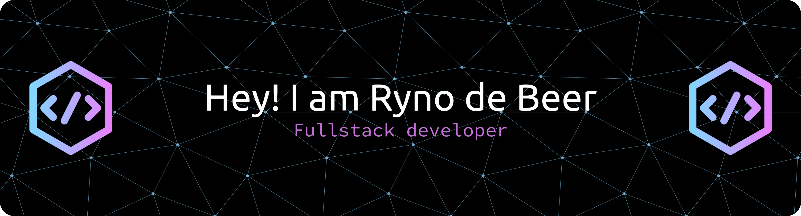

## Hi there 👋

### About Me

I am a full stack developer who is passionate about backend. I enjoy designing and developing creative solutions that are cutting-edge and imaginative, yet still user-centric. In my free time, I enjoy gaming, playing squash and 

I am currently completing my studies in Creative Technologies at Open Window, majoring in Interactive Development.

***

### GitHub Stats

  
  &nbsp;&nbsp;
  

***

### Featured Projects

  
  &nbsp;&nbsp;
  
    
  

***

### Tech Stack
#### Languages

#### Frameworks
&nbsp;
&nbsp;

#### Databases, Cloud and Devops
 &nbsp;

#### Tools

***

### Contact Information
- Email: ryno.debeer12@gmail.com
- Linkedin: [Ryno de Beer](https://www.linkedin.com/in/rynodebeer01/)

***

### Acknowledgements & Resources
- Stats and Cards: [GitHub Readme stats](https://github.com/anuraghazra/github-readme-stats)
- Icons: [Skill Icons](skillicons.dev)
- Banner: [GitHub Profile Header Generator](https://leviarista.github.io/github-profile-header-generator/)

<!--
**Rynoo1/Rynoo1** is a ✨ _special_ ✨ repository because its `README.md` (this file) appears on your GitHub profile.

Here are some ideas to get you started:

- 🔭 I’m currently working on ...
- 🌱 I’m currently learning ...
- 👯 I’m looking to collaborate on ...
- 🤔 I’m looking for help with ...
- 💬 Ask me about ...
- 📫 How to reach me: ...
- 😄 Pronouns: ...
- ⚡ Fun fact: ...
-->
